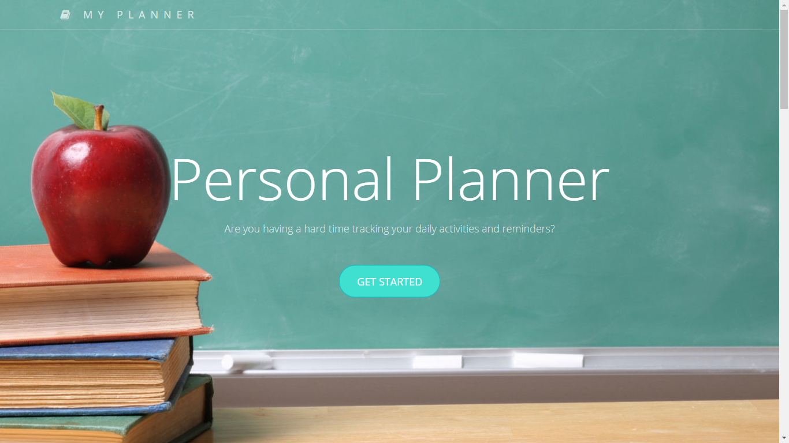
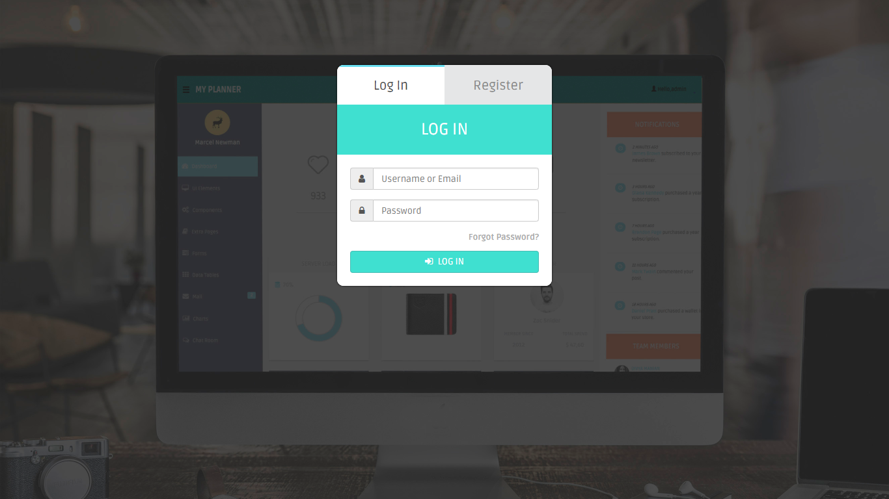
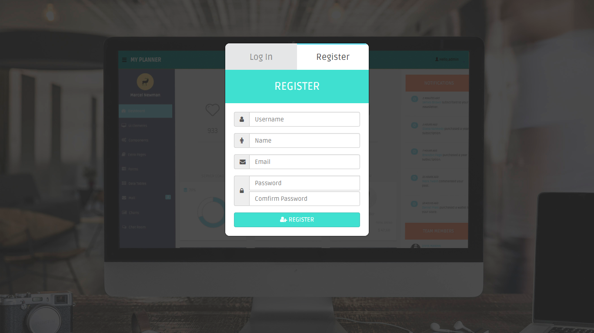
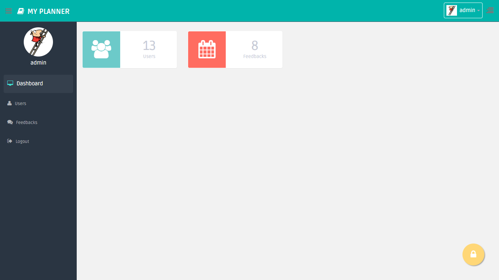
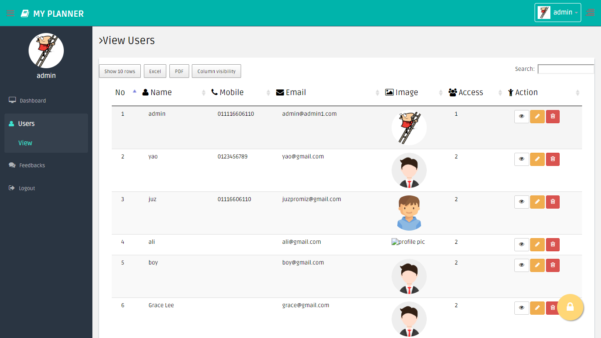
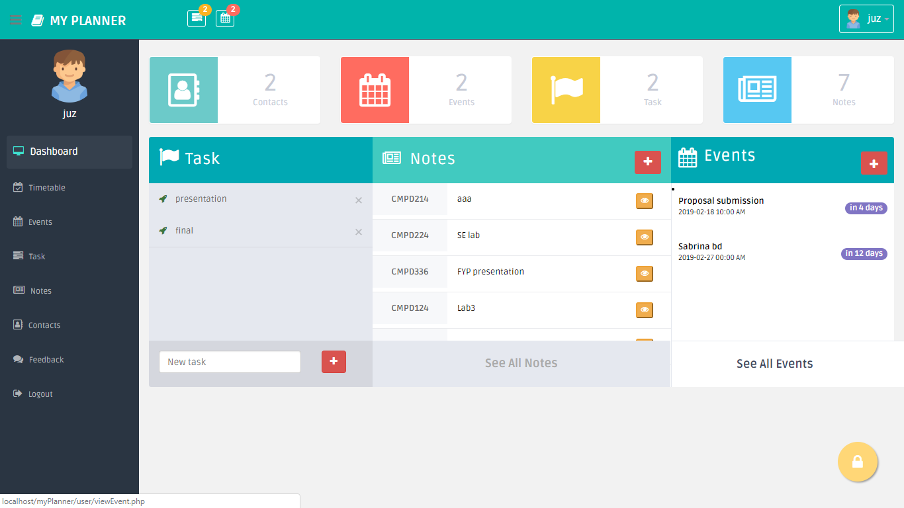
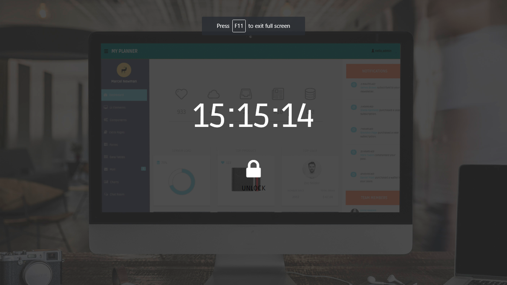
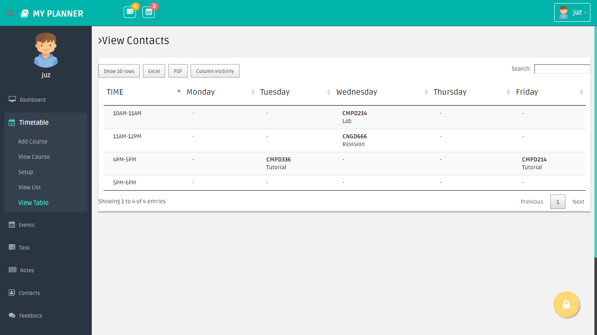
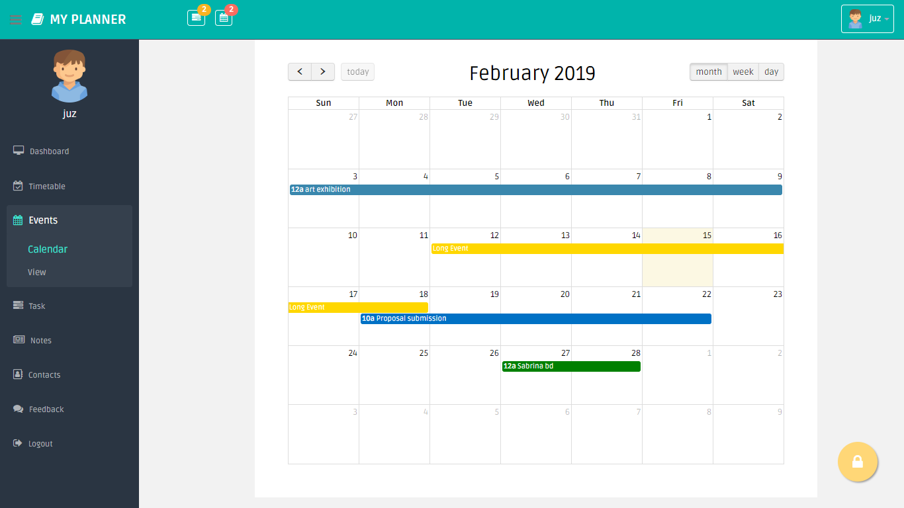
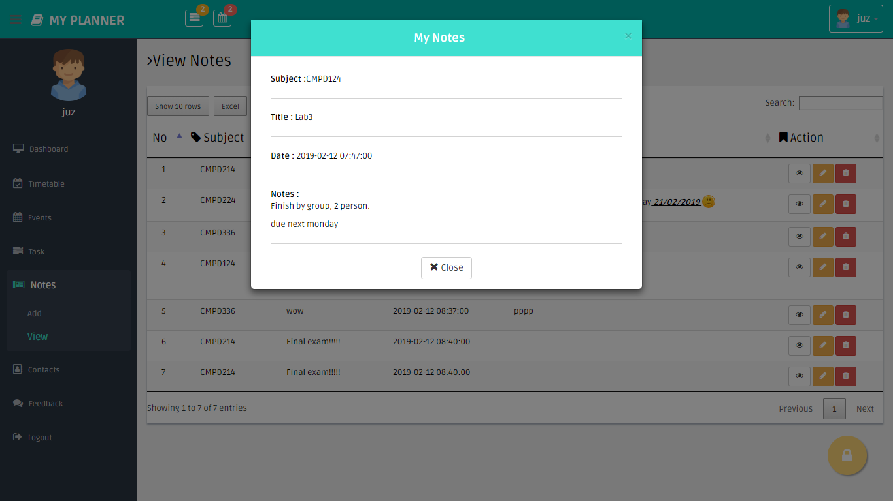

# myPlanner
Final Year Project for Diploma in Computer Science.

A Digital Student Planner System using PHP programming, SQL as backend database & run in WAMP server.

<h2>Features</h2>
<ul>
  <li>Login</li>
  <li>Admin & User permission</li>
  <li>Admin - User management</li>
  <li>User - Timetable management & Calendar</li>
  <li>User - Add/Edit/View</li>
  <li>User - To-do-list, Notes, Contact</li>
  <li>User - Export document to Excel/PDF</li>
 <li>User - Notification (Pop up)</li>
 <li>User - Security Lock screen</li>
  <li>Cool & user-friendly Output design</li>
</ul>

<h2>Database</h2>
  <ul><li>File name : fyp.sql</li></ul>

<h2>Screenshots</h2>
<ul></ul>
<ul></ul>
<ul></ul>
<ul></ul>
<ul></ul>

